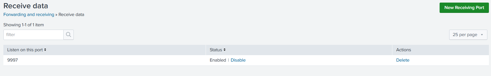
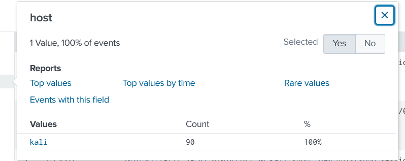
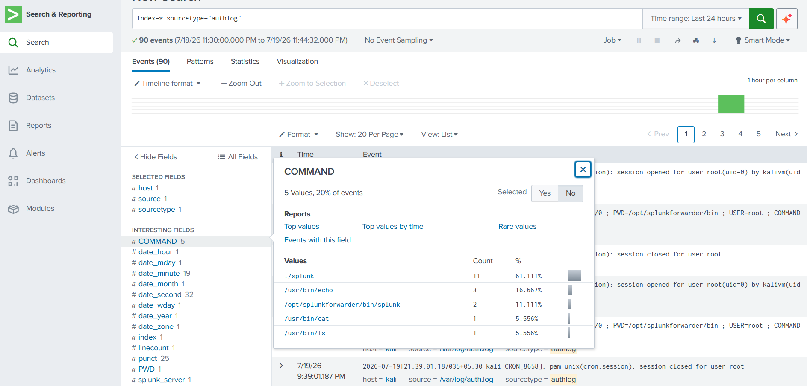

# Module 01: Splunk Lab Environment Setup & Log Collection

## Project Overview
The objective of this lab was to build a centralized log collection environment using Splunk Enterprise and the Splunk Universal Forwarder. Splunk Enterprise was deployed on a Windows 11 system to act as the monitoring server, while the Universal Forwarder was installed on a Kali Linux virtual machine to forward Linux system and authentication logs.

---

## Architecture & Lab Environment Details

* **Central SIEM Monitoring System:** Splunk Enterprise (v10.4.1) hosted on Windows 11
* **Monitored Endpoint:** Kali Linux Rolling Distribution hosted on Oracle VirtualBox
* **Log Forwarder:** Splunk Universal Forwarder (v10.4.1)
* **Default Log Forwarding Port:** TCP 9997

---

## Deployment & Configuration Procedures

### 1. Splunk Enterprise Installation (Windows Host)

1. Installed Splunk Enterprise using the official Windows MSI installer.
2. Configured the administrator account.
3. Verified that the Splunk Web interface was accessible.
4. Configured Splunk to listen for incoming data from forwarders on **TCP Port 9997**.

---

### 2. Splunk Universal Forwarder Installation (Kali Linux)

1. Downloaded the Splunk Universal Forwarder package using:

```bash
wget -O splunkforwarder-10.4.1-78803f08aabb-Linux-x86_64.tgz "https://download.splunk.com/products/universalforwarder/releases/10.4.1/linux/splunkforwarder-10.4.1-78803f08aabb-Linux-x86_64.tgz"
```

2. Extracted the downloaded package:

```bash
tar -xvzf splunkforwarder-10.4.1-78803f08aabb-Linux-x86_64.tgz
```

3. Moved the extracted folder to the `/opt` directory and navigated to the Splunk binary folder:

```bash
sudo mv splunkforwarder /opt/ && cd /opt/splunkforwarder/bin
```

4. Started Splunk, accepted the license agreement, and created the administrator credentials:

```bash
sudo ./splunk start --accept-license
```

---

### 3. Configuring Log Collection (`inputs.conf`)

The `inputs.conf` file was updated to monitor Linux system logs and authentication logs.

```ini
[monitor:///var/log/syslog]
disabled = false
index = linux_log
sourcetype = syslog

[monitor:///var/log/auth.log]
disabled = false
index = linux_log
sourcetype = authlog
```

---

### 4. Configuring Log Forwarding

1. Configured the Universal Forwarder to send logs to the Windows system running Splunk Enterprise on port **9997**.

```bash
sudo ./splunk add forward-server <Windows_Host_IP>:9997
```

2. Allowed outbound communication through the Linux firewall (UFW).

```bash
sudo ufw allow out to any port 9997 proto tcp
```

---

---

---

## Visual Verification & Telemetry Validation

To verify that the network architecture and ingestion pipeline were successfully deployed, three distinct validation steps were completed within the central Splunk Enterprise console:

### 1. Inbound Network Listener Verification
Navigating to **Settings** -> **Forwarding and receiving** confirms that the Windows host is actively listening for inbound traffic over the designated security telemetry port.



### 2. Active Endpoint Connectivity
Opening the **Search & Reporting** interface and checking the metadata properties verifies that the remote Kali Linux node is actively communicating and delivering live logs to the manager.



### 3. Raw Log Parsing & Security Field Extraction
Executing a targeted Search Processing Language (SPL) query (`index=* sourcetype=authlog`) displays the live Linux telemetry streams. Splunk successfully parses the raw command-line events into searchable key-value fields such as `USER`, `COMMAND`, and `TTY` along the interesting fields sidebar, proving active data normalization.




---

## Challenges Encountered & Solutions

### 1. Delayed Log Collection

**Problem**

During testing, newly generated logs from the Kali Linux system sometimes took several minutes to appear in Splunk.

**Solution**

The forwarder configuration was reviewed and verified. The delay was identified as normal indexing and forwarding behavior rather than a configuration issue.

---

### 2. Log Forwarding Issues

**Problem**

Initially, the Linux system was unable to forward logs to the Windows machine due to incorrect IP addresses, port configuration, or firewall settings.

**Solution**

The forwarder configuration, receiving port (TCP 9997), Windows Defender Firewall rules, and Linux UFW rules were reviewed and corrected until communication between both systems was successfully established.

---

## Outcome
A centralized log collection environment was successfully deployed using Splunk Enterprise and the Splunk Universal Forwarder. Linux system and authentication logs were securely forwarded from the Kali Linux endpoint to the Windows-based Splunk server, where they could be searched, monitored, and analyzed.


