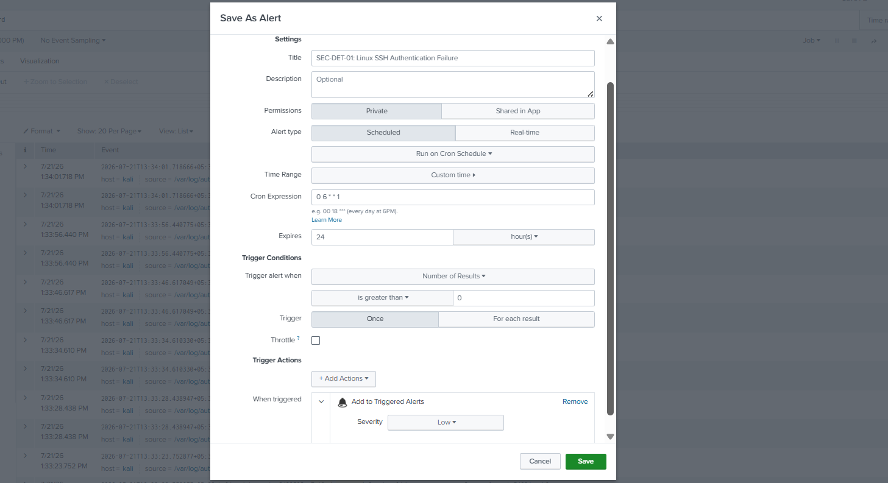
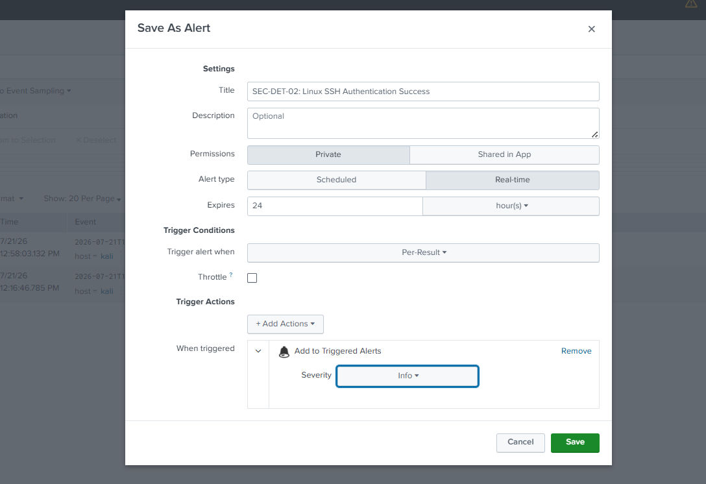
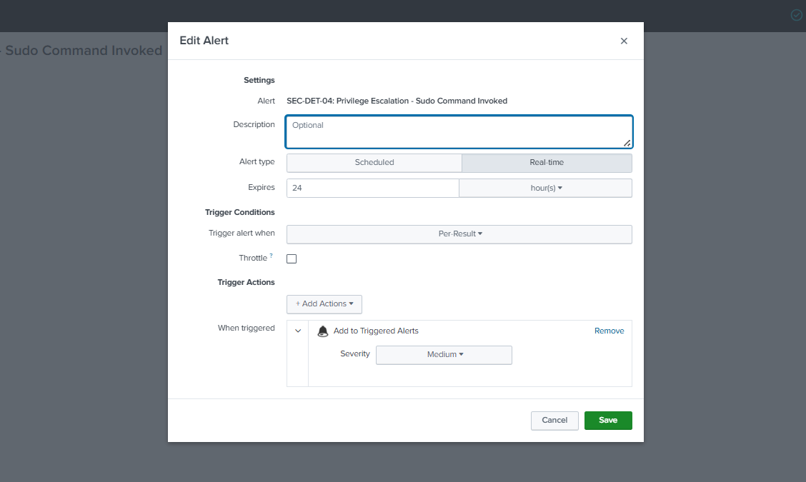
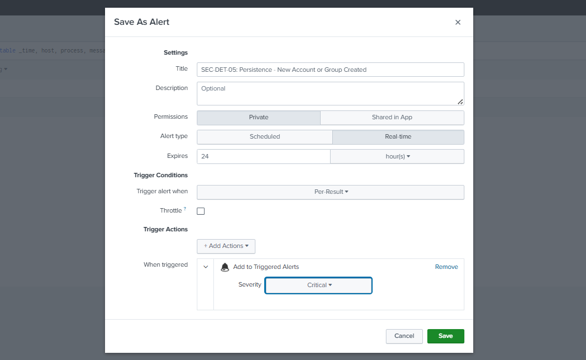

# Module 03: Security Detection Engineering with SPL

## 📌 Objective
The objective of this lab is to create alert rules in Splunk Enterprise using SPL searches. The lab demonstrates how searches can be converted into scheduled or real-time alerts for detecting common security events.

## 🎯 Learning Outcomes
By the end of this lab, you will be able to:
- Create alerts using SPL searches.
- Configure scheduled and real-time alerts in Splunk Enterprise.
- Define alert trigger conditions and thresholds.
- Associate security detections with the MITRE ATT&CK framework.

## 📋 Prerequisites
* Completion of Module 01 (Log Collection) and Module 02 (SPL Fundamentals).
* Active ingest of Linux telemetry (`source="/var/log/auth.log"` or `sourcetype=syslog`).
* Administrative access to the Splunk Search & Reporting app to save alert artifacts.

---

## 1. Introduction to Detection Engineering
Splunk alerts allow security teams to automate the detection of suspicious activity by running saved SPL searches at defined intervals or in real time. In this lab, five alert rules are created to detect common Linux security events.

---

## 2. Engineered Detection Rules

### Rule 1: Failed SSH Login Detection
* **MITRE ATT&CK Mapping:** Credential Access (TA0006) | Brute Force (T1110)
* **Operational Trigger Logic:** Identifies failed SSH authentication attempts. This rule provides visibility into unsuccessful login activity and may help identify early brute-force attempts.
* **SPL Query Execution:** 
  The following query filters system logs for the standard Linux SSH failure signature to isolate bad password attempts.
  ```splunk
  index="linux_log" Failed password
  ```
* **Splunk Alert Configuration Settings:**
  * **Alert Title:** `SEC-DET-01: Linux SSH Authentication Failure`
  * **Alert Type:** Scheduled (Runs hourly)
  * **Time Range:** `earliest=-1h latest=now`
  * **Trigger Condition:** Number of Results > 0
  * **Severity:** Low



---

### Rule 2: Successful SSH Login Detection
* **MITRE ATT&CK Mapping:** Initial Access (TA0001) | Valid Accounts (T1078)
* **Operational Trigger Logic:** Monitors successful remote access connections. Tracks legitimate user logons to establish baseline connection behavior and verify access points. While successful logins are often legitimate, unexpected or unauthorized logins may indicate the misuse of valid accounts and warrant further investigation.
* **SPL Query Execution:** 
  The following query isolates accepted authentication strings to record successful remote terminal connections.
  ```splunk
  index="linux_log" Accepted password
  ```
* **Splunk Alert Configuration Settings:**
  * **Alert Title:** `SEC-DET-02: Linux SSH Authentication Success`
  * **Alert Type:** Real-Time
  * **Trigger Condition:** Per-Result
  * **Severity:** Informational



---

### Rule 3: Excessive Successful Logins (Potential Lateral Movement)
* **MITRE ATT&CK Mapping:** Lateral Movement (TA0008) | Valid Accounts (T1078)
* **Operational Trigger Logic:** Detects an anomalous volume of successful logins within a short timeframe. A high count of successful sessions can indicate automated script interaction, credential stuffing success, or internal lateral movement.
* **SPL Query Execution:** 
  The following query counts successful logins per user and host over the search window, triggering only when the count exceeds the defined threshold.
  ```splunk
  index="linux_log" Accepted password | stats count as success_count by host, user | where success_count > 10
  ```
* **Splunk Alert Configuration Settings:**
  * **Alert Title:** `SEC-DET-03: Excessive Successful Logins Detected`
  * **Alert Type:** Scheduled (Runs every 15 minutes)
  * **Time Range:** `earliest=-15m latest=now`
  * **Trigger Condition:** Number of Results > 0
  * **Severity:** High


---

### Rule 4: Sudo Execution Tracking
* **MITRE ATT&CK Mapping:** Privilege Escalation (TA0004) | Abuse Elevation Control Mechanism (T1548)
* **Operational Trigger Logic:** Monitors elevation of privileges. This surfaces administrative actions executed via sudo, allowing analysts to audit privileged commands and detect unauthorized policy violations.
* **SPL Query Execution:** 
  The following query captures instances where the sudo subsystem is invoked and outputs a clean table detailing the transaction.
  ```splunk
  index="linux_log" sudo | table _time, host, user, process, message | sort -_time
  ```
* **Splunk Alert Configuration Settings:**
  * **Alert Title:** `SEC-DET-04: Privilege Escalation - Sudo Command Invoked`
  * **Alert Type:** Real-Time
  * **Trigger Condition:** Per-Result
  * **Severity:** Medium



---

### Rule 5: New User Creation (Persistence Detection)
* **MITRE ATT&CK Mapping:** Persistence (TA0003) | Create Account (T1136)
* **Operational Trigger Logic:** Flags account creation events. Attackers often provision new local accounts to maintain a persistent backdoor inside a compromised network.
* **SPL Query Execution:** 
  The following query monitors user account management actions by searching for system strings generated when creating new local users or groups.
  ```splunk
  index="linux_log" "new user" OR "new group" OR "add to group" | table _time, host, process, message
  ```
* **Splunk Alert Configuration Settings:**
  * **Alert Title:** `SEC-DET-05: Persistence - New Account or Group Created`
  * **Alert Type:** Real-Time
  * **Trigger Condition:** Per-Result
  * **Severity:** Critical



---

## 3. Summary Matrix for SOC Triage
The saved alerts are consolidated into this master operational matrix. This serves as the primary reference table for Tier-1 SOC analysts to rapidly validate and prioritize inbound detections.

| Rule Identifier | Alert Name | Severity | Trigger Type | MITRE Mapping | Operational Focus |
| :--- | :--- | :--- | :--- | :--- | :--- |
| **SEC-DET-01** | Linux SSH Authentication Failure | Low | Scheduled (1h) | T1110 (Brute Force) | Tracks baseline authentication noise and spray attempts. |
| **SEC-DET-02** | Linux SSH Authentication Success | Informational | Real-Time | T1078 (Valid Accounts) | Establishes access tracking and builds audit trails. |
| **SEC-DET-03** | Excessive Successful Logins Detected | High | Scheduled (15m) | T1078 (Valid Accounts) | Identifies automated lateral movement or script abuse. |
| **SEC-DET-04** | Privilege Escalation - Sudo Command Invoked | Medium | Real-Time | T1548 (Abuse Elevation Control) | Audits privilege elevation patterns and command logs. |
| **SEC-DET-05** | Persistence - New Account or Group Created | Critical | Real-Time | T1136 (Create Account) | Flags backdoors and unauthorized user provisioning. |


---

## 4. Conclusion
In this lab, SPL searches were converted into Splunk alerts to detect common Linux security events. Alert schedules, trigger conditions, and severity levels were configured to automate the monitoring process. These alert rules provide a foundation for the investigation and threat hunting activities performed in later modules.
