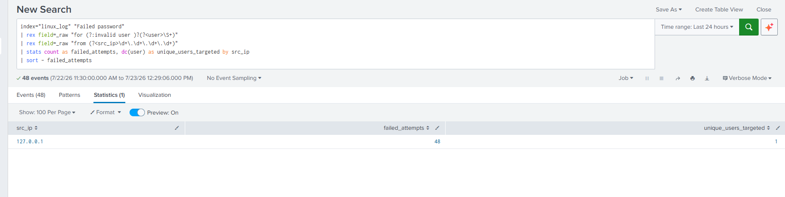
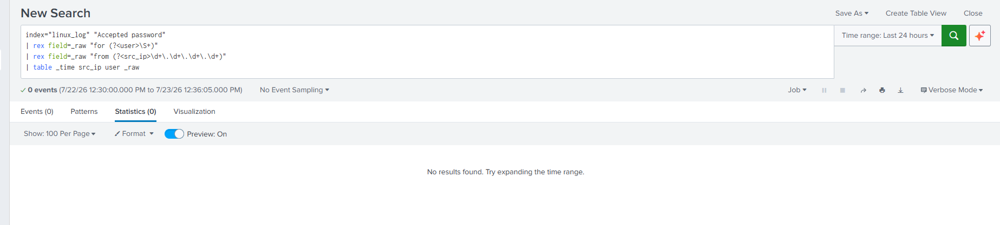
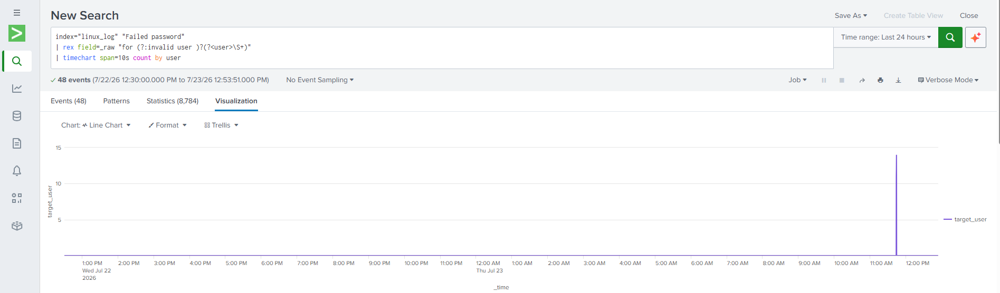

# SSH Brute-Force Investigation Using Splunk

## 📌 Incident Investigation Overview
This lab demonstrates how Splunk can be used to investigate an SSH brute-force attack against a Linux host. Using authentication logs collected from /var/log/auth.log, I identified failed login attempts, extracted useful fields from raw events, assessed whether any authentication attempts succeeded, and documented recommended response actions for a SOC analyst.

### 💡 Project objective
This project was developed to demonstrate the investigation of authentication-based attacks using Splunk. By generating controlled SSH brute-force activity with Hydra and analyzing the resulting authentication logs, the project showcases the workflow followed by a SOC analyst when investigating credential access attempts.

---

## 1. Attack Emulation Phase (Simulated attacker Perspective)
To generate realistic malicious telemetry within the environment, a high-velocity automated credential harvesting attack was launched against the Linux infrastructure.

### Step 1: Target Endpoint Configuration
The secure shell daemon (`sshd`) was initialized on the target system to expose the native network authentication interface:
```bash
sudo systemctl enable ssh --now
```

### Step 2: Automated Brute-Force Execution
An automated password-guessing loop was launched against a target profile using the standard `rockyou.txt` password directory to simulate an external threat group:
```bash
hydra -l target_user -P /usr/share/wordlists/rockyou.txt ssh://127.0.0.1 -t 4 -V
```
*The simulation was manually terminated after 45 seconds using `Ctrl + C` to restrict excessive daily indexing volume while generating hundreds of high-fidelity authentication failure events inside `/var/log/auth.log`.*

---

## 2. SIEM Triage & Scope Isolation (SOC Analyst Perspective)

### Step 1: Attacker Footprint Mapping
Since the username and source IP were not automatically extracted from the Linux authentication logs, the rex command was used to create searchable fields before analyzing the attack. This query isolates the source IP, measures attack velocity, tracks targeted user profiles, and sorts the results to uncover the core threat footprint:

```splunk
index="linux_log" "Failed password" 
| rex field=_raw "for (?:invalid user )?(?<user>\S+)" 
| rex field=_raw "from (?<src_ip>\d+\.\d+\.\d+\.\d+)" 
| stats count as failed_attempts, dc(user) as unique_users_targeted by src_ip 
| sort - failed_attempts
```

*   **Analyst Evaluation:** The attack originated from '127.0.0.1' because the simulation was performed against the local SSH service within the lab environment. In a production environment, this field would typically contain the attacker's network address.



---

## 3. The Ultimate SOC Question: Assessing Blast Radius

### Step 1: Verifying Authentication Success
A brute-force attack is an operational nuisance, but a *successful* brute-force attack represents a critical data breach. The malicious source network identifier was audited to ensure zero successful access tokens were generated during the attack window:

```splunk
index="linux_log" "Accepted password" 
| rex field=_raw "for (?<user>\S+)" 
| rex field=_raw "from (?<src_ip>\d+\.\d+\.\d+\.\d+)" 
| table _time src_ip user _raw
```

*   **Analyst Evaluation:** This query returned **0 results** (empty data grid). No successful SSH authentication events were observed.



### Step 2: Post-Auth Kill Chain Assessment Strategy
Although no successful authentication events were identified during the investigation, a successful login would not conclude the analysis. If an Accepted password event had been detected, the next step would be to investigate the attacker's activity after authentication to determine whether any unauthorized actions were performed.

The following investigation steps would typically be performed:
**Review Privileged Command Usage:** Examine system logs for sudo activity to determine whether the authenticated user attempted to execute privileged commands.
**Investigate Post-Login Activity:** Review available system logs for evidence of suspicious activity following authentication, such as unexpected command execution, new SSH sessions, or unusual user behavior.

---

## 4. Operational Velocity Charting
To map the definitive operational spike of the Hydra toolset, a timechart aggregate was mapped to isolate the exact velocity curve over the ingestion window:

```splunk
index="linux_log" "Failed password" 
| rex field=_raw "for (?:invalid user )?(?<user>\S+)" 
| timechart span=10s count by user
```



---

## 5. Recommended Containment Actions
The investigation confirmed that no successful SSH authentication occurred during the attack. Although no compromise was identified, the following containment actions would be recommended if similar activity were observed in a production environment:

**Block the Source IP**
   Restrict further authentication attempts from the identified source IP using host-based firewall rules or network security controls.
   ```bash
   sudo iptables -A INPUT -s 127.0.0.1 -p tcp --dport 22 -j DROP
   ```

**Terminate the Attack Process**
   Stop any active brute-force process to prevent additional authentication attempts.
   ```bash
   sudo pkill -f hydra
   ```

**Review the Targeted Account**
   Examine the targeted user account for unusual login activity and reset credentials if there is evidence of compromise.

**Continue Monitoring**
   Monitor authentication logs for recurring brute-force attempts and escalate the incident if successful authentication or other suspicious activity is observed.

---

## 6. Investigation Summary

The investigation confirmed a high volume of failed SSH authentication attempts generated by a simulated brute-force attack using Hydra. Authentication logs collected from `/var/log/auth.log` were successfully ingested into Splunk and analyzed using SPL. Regular expression (`rex`) extraction was used to identify the targeted username and source IP from raw log events.

The investigation found no evidence of successful authentication (`Accepted password`), indicating that the attack did not result in unauthorized access during the observation period. Authentication activity was visualized using a time-based chart, demonstrating how abnormal login patterns can be identified quickly during an investigation.

This lab demonstrates a typical Tier-1 SOC investigation workflow, including event triage, attack scoping, authentication verification, and recommended response actions using Splunk.

---
